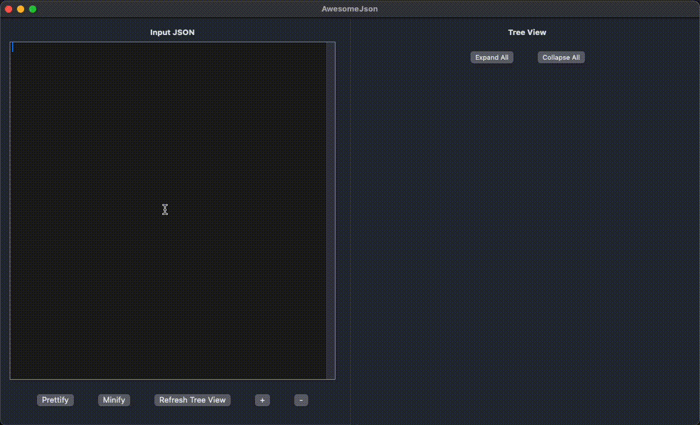

# AwesomeJson

**AwesomeJson** is a SwiftUI application for easy JSON viewing and editing. Users can input JSON, view it in a tree structure, prettify, and minify JSON text. It includes user-friendly controls to expand/collapse tree nodes, adjust font size, and validate JSON structure, making JSON manipulation easy and intuitive.

## Features

- **JSON Input Area**: A monospaced `TextEditor` for JSON input with buttons to prettify or minify JSON text.
- **Tree View**: A dynamic tree view displays the parsed JSON structure with support for nested dictionaries and arrays.
- **Expand/Collapse All**: Easily expand or collapse all nodes in the JSON tree.
- **Individual Expand/Collapse**: Control node expansion on individual items within the tree.
- **Adjustable Font Size**: Buttons to increase or decrease font size for readability.
- **Alert for Invalid JSON**: Displays an alert with error details if invalid JSON is detected.

## Screenshots

## Installation

1. Clone this repository.
2. Open the project in Xcode.
3. Run the app in the simulator or on your iOS device.

## Usage

1. **Input JSON**: Enter JSON text in the left-side editor.
2. **Prettify/Minify**: Use buttons to format the JSON.
3. **Tree View Controls**: Use Expand All, Collapse All, and individual expand/collapse buttons to navigate the tree.
4. **Font Adjustment**: Use the `+` and `-` buttons to change font size.

## File Structure

- **`ContentView.swift`**: Manages the main UI layout and JSON input controls.
- **`TreeView.swift`**: Handles the recursive tree view structure.
- **`TreeNode.swift`**: Contains individual tree node logic, including expand/collapse state.

## License

This project is open source and available under the MIT License.

